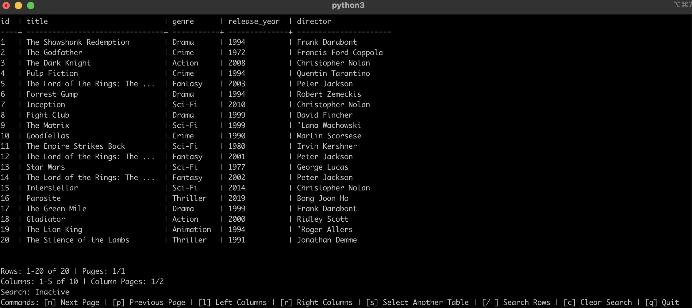

# SQL Dump File Navigator

SQL Dump File Navigator is a Python tool designed to parse SQL dump files, providing a simple navigable interface for viewing and searching table data without any other dependencies than a standard Python 3 install. It supports both a curses-based interface for terminal navigation and a fallback non-curses navigation mode.  This tool is for when you're in a pinch and need to quickly check the content of an SQL dump, most likely on a remote terminal connection, with no other tools available.  This version specifically requires a particular MySQL dump format; check the [`example_dump.sql`](example_dump.sql) file for an example.

## Features

- Parse standard MySQL dump files to extract table schemas and data
- Navigate through tables and rows using a terminal-based interface
- Search rows across all columns
- Supports both curses-based and non-curses navigation
- Horizontal paging for tables with many columns (curses mode)



## Requirements

- Python 3.x
- `curses` library (usually included with Python on Unix-based systems)

## Installation

1. Clone the repository:
    ```sh
    git clone https://github.com/kirkbowe/sql-dump-file-navigator.git
    cd sql-dump-file-navigator
    ```

2. Ensure you have Python 3 installed. You can check your Python version with:
    ```sh
    python3 --version
    ```

## Usage

1. Prepare your SQL dump file and place it in the project directory (e.g., `example_dump.sql`).  Refer to [`example_dump.sql`](example_dump.sql) for the correct dump format.

2. Run the script with the path to your SQL dump file:
    ```sh
    python3 sql-navigator.py example_dump.sql
    ```

3. Use the following commands to navigate:
    - `[n]` Next Page
    - `[p]` Previous Page
    - `[l]` Left Columns
    - `[r]` Right Columns
    - `[s]` Select Another Table
    - `[/]` Search Rows
    - `[c]` Clear Search
    - `[q]` Quit

## Command-Line Arguments

- `filepath`: Path to the SQL dump file
- `--verbose`: Enable verbose output for debugging
- `--nocurses`: Disable curses navigation

Example:
```sh
python3 sql-navigator.py example_dump.sql --verbose --nocurses
```

## License

This project is licensed under the terms of the [GPL v3.0 License](LICENSE).


